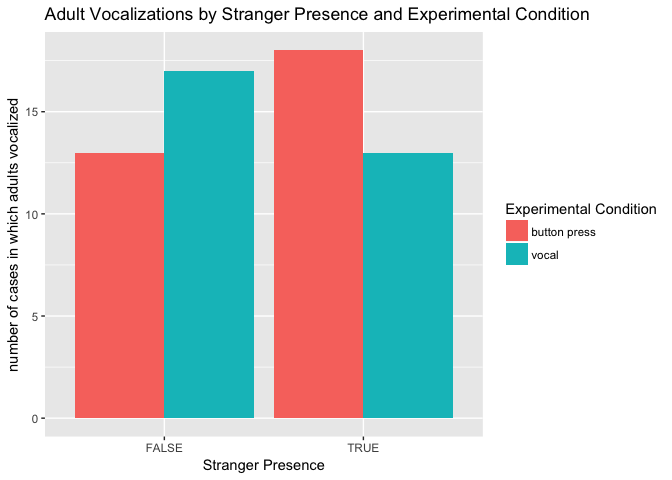

    summary(aov(SM.dx ~ adults_speaking + Error(URSI), data=adults))

    ## 
    ## Error: URSI
    ##                 Df Sum Sq Mean Sq F value Pr(>F)
    ## adults_speaking  1   0.13  0.1298   0.125  0.725
    ## Residuals       40  41.49  1.0372               
    ## 
    ## Error: Within
    ##                  Df    Sum Sq   Mean Sq F value Pr(>F)
    ## adults_speaking   1 1.190e-31 1.190e-31   1.152  0.285
    ## Residuals       125 1.291e-29 1.033e-31

    summary(aov(vocal ~ adults_speaking + Error(URSI), data=adults))

    ## 
    ## Error: URSI
    ##                 Df    Sum Sq   Mean Sq F value Pr(>F)
    ## adults_speaking  1 1.180e-31 1.178e-31   1.177  0.284
    ## Residuals       40 4.003e-30 1.001e-31               
    ## 
    ## Error: Within
    ##                  Df Sum Sq Mean Sq F value Pr(>F)
    ## adults_speaking   1   0.01  0.0130   0.039  0.844
    ## Residuals       125  41.99  0.3359

    summary(aov(stranger ~ adults_speaking + Error(URSI), data=adults))

    ## 
    ## Error: URSI
    ##                 Df    Sum Sq   Mean Sq F value Pr(>F)
    ## adults_speaking  1 2.000e-33 1.840e-33   0.016  0.901
    ## Residuals       40 4.655e-30 1.164e-31               
    ## 
    ## Error: Within
    ##                  Df Sum Sq Mean Sq F value Pr(>F)
    ## adults_speaking   1   0.01  0.0130   0.039  0.844
    ## Residuals       125  41.99  0.3359

    summary(aov(SM.dx ~ (vocal * stranger * adults_speaking) + Error(URSI), data=adults))

    ## 
    ## Error: URSI
    ##                                Df Sum Sq Mean Sq F value Pr(>F)
    ## adults_speaking                 1   0.13  0.1298   0.117  0.734
    ## vocal:adults_speaking           1   0.06  0.0630   0.057  0.813
    ## stranger:adults_speaking        1   0.30  0.2980   0.268  0.608
    ## vocal:stranger:adults_speaking  1   0.00  0.0007   0.001  0.980
    ## Residuals                      37  41.13  1.1116               
    ## 
    ## Error: Within
    ##                                 Df    Sum Sq   Mean Sq F value Pr(>F)  
    ## vocal                            1 3.980e-31 3.984e-31   4.048 0.0465 *
    ## stranger                         1 3.980e-31 3.984e-31   4.048 0.0465 *
    ## adults_speaking                  1 1.190e-31 1.191e-31   1.210 0.2736  
    ## vocal:stranger                   1 3.410e-31 3.410e-31   3.465 0.0652 .
    ## vocal:adults_speaking            1 1.100e-32 1.140e-32   0.116 0.7337  
    ## stranger:adults_speaking         1 4.400e-32 4.350e-32   0.442 0.5074  
    ## vocal:stranger:adults_speaking   1 4.000e-33 4.200e-33   0.043 0.8364  
    ## Residuals                      119 1.171e-29 9.840e-32                 
    ## ---
    ## Signif. codes:  0 '***' 0.001 '**' 0.01 '*' 0.05 '.' 0.1 ' ' 1

    summary(aov(adults_speaking ~ (vocal * stranger * SM.dx) + Error(URSI), data=adults))

    ## 
    ## Error: URSI
    ##           Df Sum Sq Mean Sq F value Pr(>F)
    ## SM.dx      1  0.061  0.0611   0.125  0.725
    ## Residuals 40 19.540  0.4885               
    ## 
    ## Error: Within
    ##                       Df Sum Sq Mean Sq F value Pr(>F)  
    ## vocal                  1  0.006  0.0060   0.038 0.8454  
    ## stranger               1  0.006  0.0060   0.038 0.8454  
    ## vocal:stranger         1  0.482  0.4821   3.095 0.0811 .
    ## vocal:SM.dx            1  0.005  0.0049   0.032 0.8593  
    ## stranger:SM.dx         1  0.058  0.0575   0.369 0.5445  
    ## vocal:stranger:SM.dx   1  0.000  0.0001   0.001 0.9777  
    ## Residuals            120 18.693  0.1558                 
    ## ---
    ## Signif. codes:  0 '***' 0.001 '**' 0.01 '*' 0.05 '.' 0.1 ' ' 1

    adults %>%
      group_by(stranger, vocal) %>%
      filter(adults_speaking == TRUE) %>%
      ggplot(aes(x=factor(vocal, labels=c("button press", "vocal")), fill=factor(stranger))) + geom_bar(position="dodge") + guides(fill=guide_legend(title="Stranger Presence")) + labs(title="Adult Vocalizations by Experimental Condition and Stranger Presence", x = "Experimental Condition", y="number of cases in which adults vocalized")

    adults %>%
      group_by(stranger, vocal) %>%
      filter(adults_speaking == TRUE) %>%
      ggplot(aes(x=factor(stranger), fill=factor(vocal, labels=c("button press", "vocal")))) + geom_bar(position="dodge") + guides(fill=guide_legend(title="Experimental Condition")) + labs(title="Adult Vocalizations by Stranger Presence and Experimental Condition", x = "Stranger Presence", y="number of cases in which adults vocalized")

